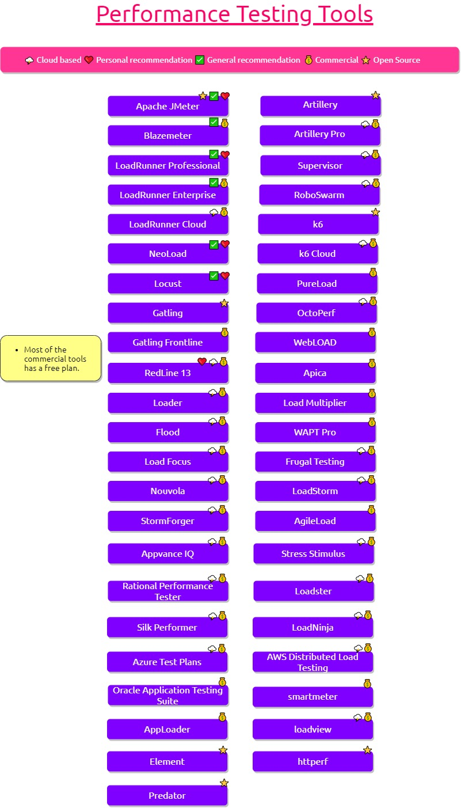

# Performance Testing Tools

[](https://github.com/QAInsights/Performance-Testing-Tools/actions/workflows/ci.yml)
[](https://perf.jmeter.ai/)
[](https://perf.jmeter.ai/)
[](https://perf.jmeter.ai/)

Performance Testing Tools is a dark-first, searchable directory of performance testing tools curated by [QAInsights](https://qainsights.com/). It is designed for engineers comparing load, protocol, cloud, enterprise, and micro-benchmark tooling without losing historical context.

Live site: <https://perf.jmeter.ai/>

Machine-readable catalogs for answer engines: [`/llms.txt`](https://perf.jmeter.ai/llms.txt), [`/llms-full.txt`](https://perf.jmeter.ai/llms-full.txt) (also at `/.well-known/llms.txt`), open dataset [`/tools.json`](https://perf.jmeter.ai/tools.json), and per-tool JSON under [`/tools/{slug}.json`](https://perf.jmeter.ai/tools/apache-jmeter.json).

Static SEO surfaces include Tier-A [`/vs/*`](https://perf.jmeter.ai/vs/apache-jmeter-vs-grafana-k6) comparisons, [`/alternatives/*`](https://perf.jmeter.ai/alternatives/apache-jmeter) hubs, and protocol/language/deployment landings.

## Run locally

```bash
npm install
npm run dev
```

Useful commands:

```bash
npm run build
npm run preview
npm run lint
npm run format:check
npm run typecheck
npm test
npm run test:e2e
```

### Deployment targets

The build defaults to the canonical root-hosted site:

- `SITE_ORIGIN=https://perf.jmeter.ai`
- `SITE_BASE=/`

These are overridable at build time:

- `SITE_ORIGIN` public origin used for canonical, Open Graph, sitemap, robots and generated catalog URLs.
- `SITE_BASE` path the copy is _served_ from, such as `/foo` for a sub-path deployment.

Examples:

```bash
npm run build                                                        # perf.jmeter.ai
SITE_ORIGIN=https://example.com npm run build                        # another host
```

## Dataset

The catalog lives in [`src/data/tools.ts`](src/data/tools.ts). Every record has a typed schema covering official URL, ownership, description, category, licensing, deployment, protocols, lifecycle status, and recommendation flags. `datasetLastVerified` is shared across the catalog. Historical or renamed products remain listed with an explicit status and successor when known.

To add or correct a tool:

1. Add or edit one typed record in `src/data/tools.ts`.
2. Verify the official site, repository, vendor, licensing, and lifecycle status.
3. Keep descriptions factual and under 140 characters.
4. Run `npm test`, `npm run typecheck`, and `npm run build`.
5. For a public correction or suggestion, [open a GitHub issue](https://github.com/QAInsights/Performance-Testing-Tools/issues/new).

Build-time generation creates `public/llms.txt`, `public/llms-full.txt`, `public/.well-known/llms.txt`, `public/manifest.webmanifest` (scoped to `SITE_BASE`), per-tool PNG OG images, and `public/robots.txt` from the dataset using the selected deployment origin and base.

## Exa enrichment pipeline

Tool pages can include grounded, periodically refreshed details about features, pricing, ownership, AI capabilities, and the latest release. The pipeline runs on the 1st and 15th of each month, using the `EXA_API_KEY` GitHub repository secret, and opens or updates an automation PR when the enrichment data changes.

Run a focused refresh locally:

```bash
EXA_API_KEY=... npm run enrich -- --slug=apache-jmeter
```

Use `--all`, `--stale-days=<n>`, `--concurrency=<n>`, and `--dry-run` for broader or test runs. Enrichment sources and fetch timestamps are stored in [`src/data/enrichment.json`](src/data/enrichment.json).

## Testing and deployment

Vitest covers dataset, SEO JSON-LD, and load-profile invariants. Playwright covers the configured base path, search URL state, filtering, and command palette behavior. The static Astro build produces the directory, category pages, detail pages, comparison page, and about page.

GitHub Actions runs formatting, linting, type checks, unit tests, Playwright, and the production build. The default build targets the canonical Vercel deployment at <https://perf.jmeter.ai/>.

## Original context

This project began as the `PerformanceTestingTools` draw.io diagram and a README list of tools. The original diagram and assets remain in the repository as historical source material. The directory preserves its personal-pick and general-pick legend while adding current lifecycle metadata.



## Note(s) 📌

- Tools are arranged in a random order.

# Contribution are welcome 💜

Please raise an issue to discuss your suggestions or open a PR to request improvements.

> Designed using [Diagrams.net](https://github.com/jgraph/drawio)

# License 📜

MIT
